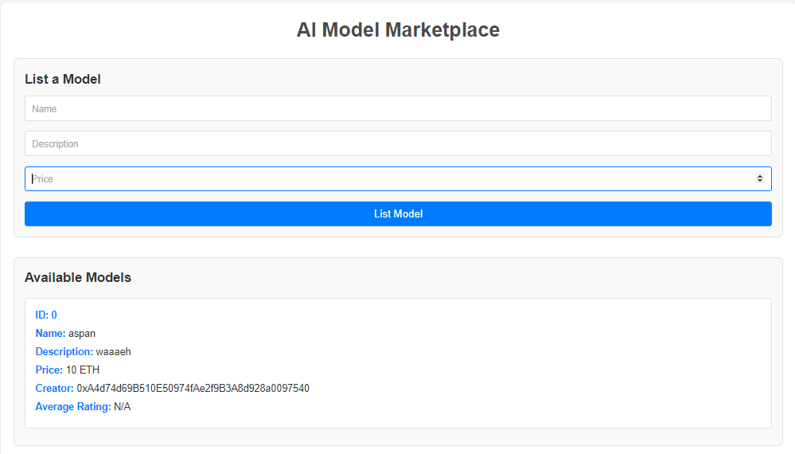
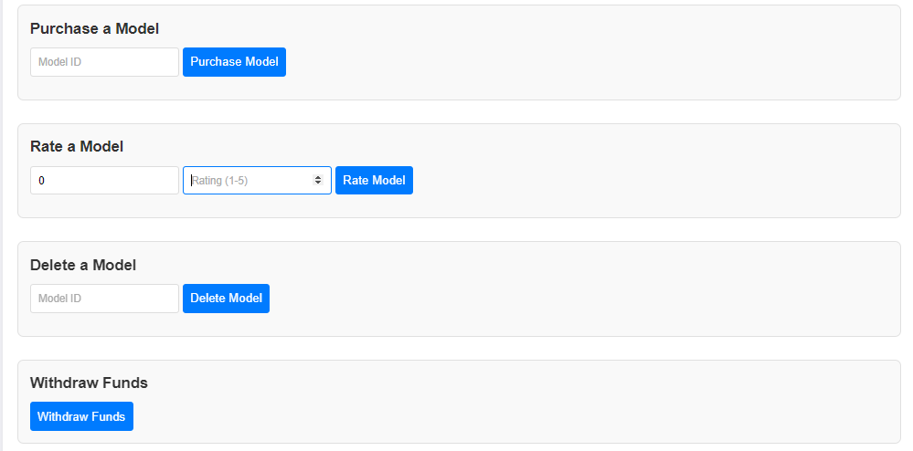

# AI Model Marketplace

## Overview
The **AI Model Marketplace** is a decentralized application (dApp) that allows users to list, purchase, and rate AI models. This project utilizes Ethereum smart contracts to manage the core functionalities of the marketplace, while the frontend provides a user-friendly interface for interaction with the smart contract.

## Features
- **List a Model**: Users can add new AI models with a name, description, and price.
- **Purchase a Model**: Users can buy models by specifying the model ID, with payments directed to the model's creator.
- **Rate a Model**: Users can rate models they've purchased, contributing to the model's average rating.
- **Delete a Model**: Creators can delete their models from the marketplace.
- **Withdraw Funds**: The contract owner can withdraw accumulated funds from model sales.

## Smart Contract Functions
- `listModel(string memory name, string memory description, uint256 price)`: Allows users to add a new AI model to the marketplace.
- `purchaseModel(uint256 modelId)`: Enables users to buy a specific AI model by its ID.
- `rateModel(uint256 modelId, uint8 rating)`: Lets users rate a purchased AI model.
- `deleteModel(uint256 modelId)`: Allows the model creator or contract owner to delete a model.
- `withdrawFunds()`: Allows the contract owner to withdraw funds from model sales.
- `modelCount()`: Returns the total number of models listed in the marketplace.

## Frontend Components
- **Model Listing Form**: Input fields to enter model name, description, and price.
- **Available Models Section**: Displays a list or grid of models available in the marketplace.
- **Purchase Button**: Allows users to buy a selected model.
- **Rating Form**: Input fields for users to rate a model they have purchased.
- **Delete Button**: Allows model creators to delete their models from the marketplace.
- **Withdraw Button**: Allows model creators to withdraw their funds.

## Screenshots

# Usage Instructions

## 1. List a Model
To list a model:
- Fill in the **Model Name**, **Description**, and **Price** in the **List a Model** form.
- Click the **List Model** button.

## 2. Purchase a Model
To buy a model:
- Enter the **Model ID** in the **Purchase** section.
- Click the **Purchase Model** button.
- Confirm the transaction in your wallet.

## 3. Rate a Model
After purchasing a model, you can rate it:
- Enter the **Model ID** and your **Rating** (1-5) in the **Rating** section.
- Click the **Rate Model** button.

## 4. Delete a Model
If you are the creator of a model, you can delete it:
- Enter its **ID** in the **Delete** section.
- Click the **Delete Model** button.

## 5. Withdraw Funds
If you are the contract owner:
- Click the **Withdraw Funds** button to withdraw available funds.

## License

This project is licensed under the MIT License - see the LICENSE file for details.

